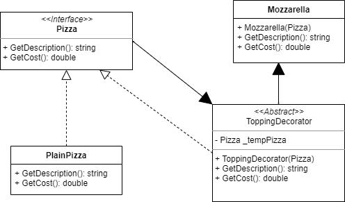

# Decorator pattern

Is a design pattern that allows behavior to be added to an individual object, dynamically, without affecting the behavior of other objects from the same class. The decorator pattern is often useful for adhering to the Single Responsibility Principle, as it allows functionality to be divided between classes with unique areas of concern. The decorator pattern is structurally nearly identical to the chain of responsibility pattern, the difference being that in a chain of responsibility, exactly one of the classes handles the request, while for the decorator, all classes handle the request.

## What is the Decorator Pattern

* The Decorator allows you to modify an object dynamically
* You would use it when you want the capabilities of inheritance with subclasses, but you need to add functionality at run time
* It is more flexible than inheritance
* Simplifies code because you add functionality using many simple classes
* Rather tha rewrite old code you can extend with new code

