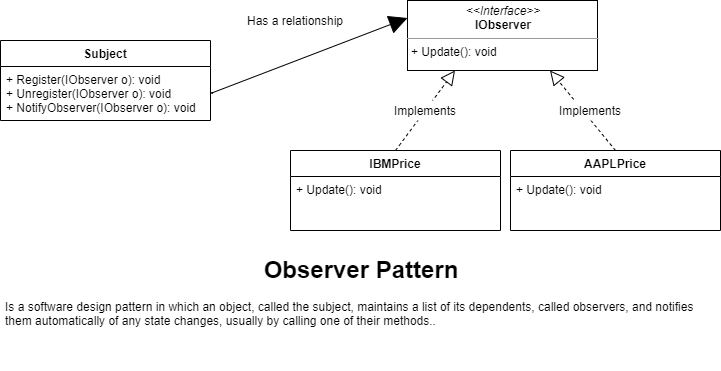

# Observer pattern

Define a family of algorithms, encapsulate each one, and make them interchangeable. It lets the algorithm vary independently from clients that use it

## When to use the Observer Pattern

* When you need many other objects to receive an update when another object changes
	* Stock market with thousands of stock needs to send updates to objec representing individual stocks
	* The Subject (publisher) sends many stocks to the Observers
	* The Observers (subscribers) takes the ones they want and use them
*Loose coupling is a benefit
	* The Subject (publisher) doesn't need to know anythin about the Observers (subscribers)
*Negatives: The Subject (publisher) may send updates that don't matter to the Observer (subscriber)

