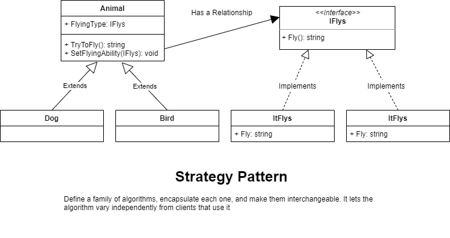

# Strategy pattern

Define a family of algorithms, encapsulate each one, and make them interchangeable. It lets the algorithm vary independently from clients that use it

## When to use the Strategy Pattern

* When you want to define a class that will have one behaviour that is similar to other behaviours in a list
	* I want the class objkect to be able to choose from
		* Not flying
		* Fly with Wings
		* Fly Super Fast
* When you need to use one of several behaviours dynamically
* Often reduces long lists of conditionals
* Avoids duplicate code
* Keeps class changes from forcing other class changes
* Can hide complicated / secret code from the user
* Negative: Increased number of Object / Classes

